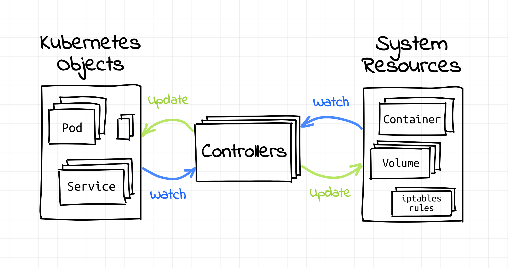
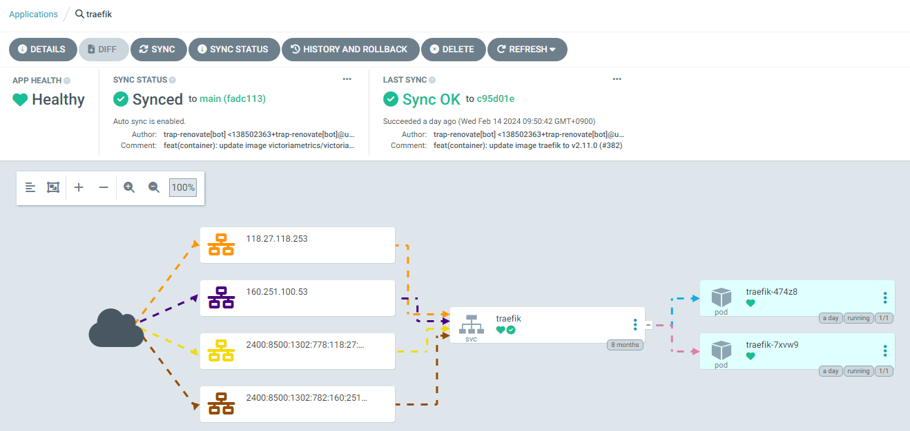

# しくみから分かる Kubernetes

## Kubernetes とは

Kubernetes（k8s）とは、オープンソースの **Container Orchestration System** です。
https://kubernetes.io/

...と、少なくとも上のトップページでは紹介されています。

複数のノード（VPS とか物理マシンとか）を管理し、コンテナ化されたアプリを人間の代わりに管理してくれます。
ここで、まとまった複数のノードは**クラスター**と呼ばれます。

Dockerなどをそのまま使うのに比べて、大きく見て次のメリットがあります。

- **複数種のコンテナ**を、**安定して**、かつ**自動的に**デプロイできる。
- **大量のトラフィック**を安定的に捌くために、**たくさんのコンテナ**を**複数ノードに渡って**デプロイできる。

## 簡単な仕組み

誤解を恐れずにいうと、k8s は単に **KVS** (**key value store**) と**コントローラ**から成ります。

以下のような「**オブジェクト**」を yaml で宣言し、REST API を通じて KVS（下画像の Kubernetes Objects）にぶちこむことで、インフラの状態を「**宣言的に**」管理します。
この yaml の宣言は、manifest とも呼ばれます。

```yaml
apiVersion: v1
kind: Pod
metadata:
  name: nginx
spec:
  containers:
  - name: nginx
    image: nginx:1.14.2
    ports:
    - containerPort: 80
```

「宣言的に」とは、「最終的な状態だけを定義しておき、そこに至るまでの具体的な操作は記述しない」ということです。

オブジェクト更新等のイベント発生時や定時実行をトリガーとし、各コントローラが現在の状態と理想状態の差異を計算します（下画像の Watch）。
この差異から、具体的なインフラの操作や、別オブジェクトの管理を行い、システムの状態を少しずつ理想状態に近づけます（下画像の Update）。

この差異の計算と操作のループのことを、"**reconciliation loop**"と呼びます。
シンプルですが、この reconciliation loop の組み合わせが非常に堅牢なことが実証されており、デプロイを安定して自動化できる仕組みとなっています。



画像元: https://iximiuz.com/en/series/writing-kubernetes-controllers-operators/

## 基本オブジェクト

すごく簡潔に説明すると、こんな感じです。

- Pod: コンテナを1個以上詰め込める。同一pod内のコンテナは互いにlocalhostでアクセスできる。
    - 基本的には 1 Pod = 1 コンテナ
    - だいたいdockerのコンテナと同じと思っておけばいい
- Service: Podに外部からTCP/UDP(L4)通信するために必要。複数のpodを選択できる。
    - type: NodePortやLoadBalancerで外部にポートを公開できる
- Ingress: Podに外部からHTTP(L7)通信するために必要。複数のserviceを選択できる。
    - 最近はGateway APIとかいうのもあるらしい

ネットワーク関連(ServiceやIngress)がコンテナの実態(Pod)と切り離されているのは、1個のServiceやIngressで複数個のPodを指定して**ロードバランス**させるためです。

次の画像は、「ArgoCD」という Kubernetes を管理するアプリケーションの、一画面です。
Service オブジェクト（画像内では "svc" と略されている）が、あるIPに来たトラフィックをPodに橋渡ししている様子が、視覚的に表現されています。



ArgoCD の管理画面

## オブジェクトの階層構造

普通は直接 Pod を扱うのではなく、DeploymentやStatefulSetなど、「上位の」オブジェクトを人間が扱います。
Deployment Controller などの各コントローラが、Deployment などの「上位の」オブジェクトを監視し、ReplicaSet、Pod などの「下位の」オブジェクトを管理します。

Pod が単にコンテナ 1 つを管理するのに対して、Deployment や StatefulSet はそのレプリカ数、ノードが壊れた場合の Pod の再起動・再設置、バージョン管理、起動の順番の管理などを行う、といった具合です。

次の画像も「ArgoCD」の一画面です。
「上位」と「下位」のオブジェクトと、その対応関係が視覚的に理解できます。
画像内の deploy は Deployment、sts は StatefulSet、rs は ReplicaSet の略です。


ArgoCD の管理画面

## 実際の運用

kubectl（CLI）を使い、黒いターミナル画面でカタカタやってるイメージがあるかもしれませんが、わざわざターミナル画面で苦しむ必要はありません。

- **リッチな GUI / 自動化ツール**を用いて管理・監視を行える。
    - 例: Rancher, ArgoCD, Portainer, Lens, ...
- 必要なものが詰まった**様々な distribution**が用意されているため、セットアップも楽になっている。
    - 例: k3s, k0s, microk8s, k3d, kind, ...

※Distribution: Kubernetes と関連パッケージ・設定などをまとめて配布し、使いやすくしたもの。

エコシステムがかなり整っているので、好きな GUI を使ったり、コマンド一つでセットアップできる distribution を使ったりできます。

### とにかくなんか触りたい人へ

とりあえず「触って理解したい！」人には、コマンド一つで入る k3s や、環境を汚さず遊べる k3d（k3s on docker）が、個人的なオススメです。
NeoShowcase の開発では、3 ステップで k3d のインストール、環境の構築、環境の完全削除が可能になっています。

[3 ステップ構築](https://github.com/traPtitech/NeoShowcase/blob/main/docs/development.md#k8s-backend-k3d)

traP で運用している ArgoCD を覗いてみるのもオススメです。

https://cd.trap.jp/
※traP メンバー限定

## トリビア

Kubernetes の、k と s の間に 8 文字あるから k8s と略します。
[Numeronym](https://en.wikipedia.org/wiki/Numeronym) というらしい。

Kubernetes は、Google 内部のインフラ管理システムがオープンソース化したプロジェクトです。
Golang 製であり、現在も活発に開発が行われています。
GitHub のリポジトリの中で合計 contributor 数で数えると、Top 10 に入るとか入らないとか。

## 次へ

さらに細かいことが気になった人は、**公式ドキュメントを**探検してみましょう。
Kubernetes の基本情報は、公式が最も正しく、網羅的に書いてあります。

- トップページ: https://kubernetes.io/
- ドキュメント: https://kubernetes.io/docs/home/
    - 用語集: https://kubernetes.io/docs/reference/glossary/?fundamental=true
    - Deployment: https://kubernetes.io/docs/concepts/workloads/controllers/deployment/
    - StatefulSet: https://kubernetes.io/docs/concepts/workloads/controllers/statefulset/

ハンズオンを進めながら、上のドキュメントを横で眺めるのもおすすめです。
必須ではないですが、公式の説明も見たほうが理解が深まるでしょう。
（ここでの説明も完璧ではないため、往々にして公式の説明がより洗練されています。）

もちろん、先に進みたい人は、そのまま進んでもらって構いません。
最速で Kubernetes の良さ（の一つ）を理解できるように、必要な情報だけをまとめていったつもりです。

次のページでは、ハンズオンを行うためのツールの準備を行います。
ぜひこれ以降のハンズオンにも挑戦してみてください！

[./1_tools.md](./1_tools.md)
