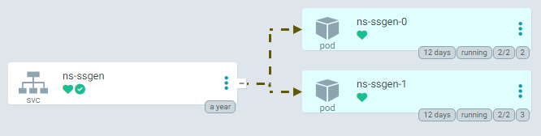

# Service / Ingress

## Pod 群にアクセスする方法

これまで Deployment や StatefulSet を用いて、（複数の）Pod 達をデプロイしたり、バージョン管理する方法を学びました。

また、Pod が提供するWebページやサービスにアクセスする時は、`kubectl port-forward` コマンドを使いました。

しかし、これ以外の方法で、クラスター内部や外部から、Webページやサービスにアクセスするにはどうしたらよいでしょうか？
複数 Pod をデプロイしている場合は、大量のリクエストを捌くため、各 Pod になるべく均等にリクエストが渡るようにもしたいです。

これを解決するオブジェクトが Service と Ingress です。

> [!NOTE]
> 最近では Ingress に取って代わるものに [Gateway API](https://kubernetes.io/docs/concepts/services-networking/gateway/) というものが開発されていますが、ここでは扱いません。
> Ingress の本質を理解すれば、Gateway API もすぐに理解できます。

## Service とは

複数の Pod に通信を分散する、Layer 4（TCP or UDP）ロードバランサーです。

Service の宛先 Pod として、前ページで用いた `caddy` の Deployment を使うため、クラスターに適用しておきます。

- `kubectl apply -f ./examples/4_deployment.yaml`

早速 Service の定義例を見てみましょう。

```yaml
apiVersion: v1
kind: Service
metadata:
  name: caddy

spec:
  # Service の種類
  type: ClusterIP
  # Pod のセレクター
  selector:
    app: caddy
  # サービスの port 一覧
  ports:
    - name: web
      protocol: TCP  # 省略可能 (default: TCP)
      port: 80       # Service が提供するポート番号
      targetPort: 80 # Pod の宛先ポート番号
```

[../examples/5_service.yaml](../examples/5_service.yaml)

- `.spec.type` : Service の種類。`ClusterIP`, `NodePort`, `LoadBalancer` などがある[^1]。
- `.spec.selector` : Service の宛先 Pod を計算するためのセレクター。Service が受けた通信は、このセレクターによって列挙された Pod のうちいずれかに渡る。Service の宛先は、Pod が変化すると動的に再計算される。
- `.spec.ports` : Service が提供するポート一覧。Service が提供するポート番号と、そこにアクセスした時 Pod の何番ポートに通信を渡すかをマッピングする。

[^1]: https://kubernetes.io/docs/concepts/services-networking/service/

Service の定義すべきフィールドはそこまで多くありません。
宛先 Pod の計算方法（セレクター）を定義し、ポート番号のマッピングを定義するだけです。

Service はセレクターによって宛先 Pod 一覧を取得しますが、この宛先 Pod 一覧は、Pod の変化に伴って、常に**動的に再計算されます**。
つまり、Service のセレクターに一致する Pod を Deployment などで変化させることで、Service には手を加えずに、Service の宛先 Pod 一覧を動的に変更できるということです。

> [!NOTE]
> ボーナス知見: この「Service の宛先 Pod 一覧」は EndpointSlice[^2] というオブジェクトによって管理されています。
> この Slice という単語は、Kubernetes が Go 言語で書かれており、Go 言語でリストを表すのに使う「スライス」から来ています。

[^2]: https://kubernetes.io/docs/concepts/services-networking/endpoint-slices/

したがって、常にセレクターにマッチする Ready 状態の Pod を絶やさないことにより、**Service にダウンタイムを発生させないように**できます。
前ページで説明した、Deployment のアップデート戦略と組み合わせるのが一般的です。



↑ Service のイメージ。Service は複数の Pod をセレクターで選択し、Service の IP 宛に来た TCP or UDP 通信を、ランダムで Pod の 1 つに渡す（プロキシーする）。

### Service を使う

実際に Service をクラスターに適用してみましょう。

- `kubectl apply -f ./examples/5_service.yaml`

作成されたサービスと、その IP を確認します。

- `kubectl get services`

```plaintext
$ kubectl get services
NAME         TYPE        CLUSTER-IP     EXTERNAL-IP   PORT(S)   AGE
kubernetes   ClusterIP   10.43.0.1      <none>        443/TCP   3m37s
caddy        ClusterIP   10.43.13.144   <none>        80/TCP    2m52s
```

（IP は Service 作成時に決定され、指定しない限り毎回変わりますが、問題ありません。）

また、ここで宛先として設定した Pod の各 IP も次コマンドで確認しておきましょう。

- `kubectl get pods -o wide`

```plaintext
$ kubectl get pods -o wide
NAME                     READY   STATUS    RESTARTS   AGE    IP          NODE                   NOMINATED NODE   READINESS GATES
caddy-6977985c98-cd8r8   1/1     Running   0          3m9s   10.42.2.4   k3d-hands-on-agent-2   <none>           <none>
caddy-6977985c98-vbkx2   1/1     Running   0          3m9s   10.42.1.5   k3d-hands-on-agent-1   <none>           <none>
caddy-6977985c98-zkpkk   1/1     Running   0          3m9s   10.42.0.5   k3d-hands-on-agent-0   <none>           <none>
```

各 Pod に異なる IP が割り振られ、かつ Service の IP とも違うことが確認できます。

本当に Service がこれらの Pod を選択できているのでしょうか？

Service の詳細な情報を確認するには、次のコマンドを実行します。

- `kubectl describe service caddy`

```plaintext
$ kubectl describe service caddy
Name:              caddy
Namespace:         default
Labels:            <none>
Annotations:       <none>
Selector:          app=caddy
Type:              ClusterIP
IP Family Policy:  SingleStack
IP Families:       IPv4
IP:                10.43.13.144
IPs:               10.43.13.144
Port:              web  80/TCP
TargetPort:        80/TCP
Endpoints:         10.42.0.5:80,10.42.1.5:80,10.42.2.4:80
Session Affinity:  None
Events:            <none>
```

少し見にくいですが、`Endpoints` に 3 つの IP が確認できます。
これを先程の Pod の IP と照らし合わせると、確かに Service は Pod の IP が選択できていると分かります。

> [!NOTE]
> ボーナス: 次のコマンドを実行して、Service が裏で管理しているオブジェクトである EndpointSlice を覗いてみましょう。
>
> - `kubectl get endpointslices`
> - `kubectl describe endpointslice caddy-vdw57`
>     - 上で手に入れた名前を、`caddy-vdw57` と置き換える

### Service への通信

Service をクラスターへ登録したので、Service 経由で Pod へ通信してみたいですね。

Service へ通信する方法はいくつかあります。

1. Service の ClusterIP を使う（クラスター内のみ）

各 Pod や Service には作成時にランダムで IP が割り振られます。
しかし Pod はよく Deployment などによって再作成され入れ替わるのに対し、Service は一度定義したら基本的に変更しないオブジェクトです。

これを考慮すると、特定のラベル（例: `app: caddy`）の付いた Pod に通信を行いたい場合は、Service の IP（例: `10.43.128.113`）へ通信を行うと、Pod の再作成といった裏側の変化を気にせずに通信を行うことができます。

通常、ClusterIP へ通信ができるのは、クラスターにデプロイされたコンテナからのみとなります。

2. Service の名前を CoreDNS で解決する（クラスター内のみ）

Kubernetes クラスターには、CoreDNS と呼ばれる DNS サーバーがよく一緒にデプロイされます。
（本ハンズオンでも、k3s によって自動でデプロイされています。）

クラスター内のコンテナから、Service 名をそのままホスト名として通信を試みることで、CoreDNS によって Service の ClusterIP に解決されます。
例: `http://caddy:80/` へHTTPリクエストを送ると、`caddy` というホスト名は CoreDNS によって `10.43.128.113` に解決される。

> [!NOTE]
> 違う namespace から通信を行う場合、`{Service名}.{namespace名}` がホスト名となります。
> また、FQDN は `{Service名}.{namespace名}.svc.cluster.local` となるため、これでも通信ができます。

通常、CoreDNS を使えるのは、クラスター内のコンテナからのみです。
したがってこの方法が使えるのも、クラスター内からの通信のみとなります。

3. `type: NodePort` や `type: LoadBalancer` を活用する（クラスター内・外から）

`type: NodePort` を指定すると、各 Worker node の高いポート番号（デフォルト: 30000-32767）で Service を提供します。
例えば選ばれたポート番号が `30001` の場合、`{Worker nodeの(外部)IP}:30001` へ通信を行うことで、Service へ通信を行えます。
したがって、Worker node が外部 IP を持つ場合は、外部から通信が行えるようになります。

また、この Worker node のポート番号宛に `cloudflared` や `ngrok` などの tunnel agent を向けさせることで、クラスター外部からの通信を許可する方法もあるようです。

`type: LoadBalancer` を指定すると、クラスターのプロバイダー依存で Service を外部に提供します。
プロバイダー依存というのは、Kubernetes の distribution（例: GKE, EKS, k0s, k3s, ...）によって動作が異なるということです。
このハンズオンでは k3d を通して k3s を使っているため、ServiceLB[^3] と呼ばれるコンポーネントにより、Service が外部へ提供されます。

[^3]: https://docs.k3s.io/networking/networking-services#service-load-balancer

### Service への通信を試す

先ほど定義した Service へ、通信が行えることを確認しましょう。

まずクラスター内部から、ClusterIP 宛の通信を確認します。

次のコマンドで、クラスター内部に一時的なコンテナを作成します。

- `kubectl run --rm -it tmp --image alpine:latest`

このコンテナ内で、curl をインストールし、先ほどの Service の ClusterIP 向けに通信を行ってみましょう。

- `apk add curl`
- `curl http://10.43.128.113:80/`
    - ClusterIP は先ほど `kubectl get service caddy` で手に入れたものです。`10.43.*.*` の形をしているはず。
- `curl http://caddy:80/`
    - CoreDNS 経由の IP 解決も試してみましょう。

少し見にくいですが、HTML が流れてきたら成功です。

```plaintext
# curl http://10.43.128.113:80/
<!DOCTYPE html>
<html>
<head>
        <title>Caddy works!</title>
...
```

次に、`type: LoadBalancer` を用いて、外部からの通信を確認します。

```yaml
apiVersion: v1
kind: Service
metadata:
  name: caddy-lb

spec:
  type: LoadBalancer
  selector:
    app: caddy
  ports:
    - name: web
      port: 8080
      targetPort: 80
```

[../examples/5_lb_service.yaml](../examples/5_lb_service.yaml)

`type: LoadBalancer` とした Service を上のように定義し、クラスターに適用します。

- `kubectl apply -f ./examples/5_lb_service.yaml`

Service が作成されたことを確認します。

- `kubectl get service caddy-lb`

```plaintext
$ kubectl get service caddy-lb
NAME       TYPE           CLUSTER-IP     EXTERNAL-IP                                   PORT(S)          AGE
caddy-lb   LoadBalancer   10.43.71.254   172.16.7.2,172.16.7.3,172.16.7.4,172.16.7.5   8080:30122/TCP   84s
```

http://localhost:8080/ へ手元のブラウザからアクセスし、再び次の画面が確認できたら成功です。


> [!NOTE]
> `type: LoadBalancer` とした Service は、k3d では `servicelb` docker コンテナ経由でアクセスできるようになります。
>
> また、[./2_first_cluster.md](./2_first_cluster.md) でクラスターを作成したコマンドの引数である、
> `--port 8080:8080@loadbalancer` が指定されることによって、`servicelb` docker コンテナの 8080 番ポートがホストの `0.0.0.0:8080` へ publish されます。
>
> したがって、ハンズオンのホスト側から `localhost:8080` で Service へアクセスできるようになります。
>
> 難しければこの仕組みは理解しなくてもOKです。

### お掃除

使った Service を削除しておきます。

- `kubectl delete service caddy`
- `kubectl delete service caddy-lb`

`caddy` の Deployment は次でも使うため、まだ削除しません。

## Ingress とは

複数の Pod に HTTP リクエストを分散する、Layer 7（HTTP）ロードバランサーです。

複数の指定した Pod にリクエストを分散するという点では Service と似ていますが、レイヤー[^4]が異なります。

[^4]: https://en.wikipedia.org/wiki/OSI_model

Service は Layer 4（TCP or UDP）のロードバランサーであり、TCP の場合は**コネクション**単位で各 Pod にロードバランスを行います。
言い換えれば、Service 経由の同一 TCP コネクション上で行われた HTTP リクエストは、同一の Pod に行き着きます。

Ingress は Layer 7（HTTP）のロードバランサーであり、**HTTP リクエスト**単位で各 Pod にロードバランスを行います。
Ingress を用いることで、同一 TCP コネクション上で HTTP リクエストが行われたかに関わらず、各 HTTP リクエストをきちんとロードバランスできます。
また、Layer 7 でロードバランスを行うため、一つの IP で複数ドメインのWebサイトをホストする、Virtual hosting[^5] や、細かいパス指定での宛先 Pod 振り分けも可能になります。

[^5]: https://en.wikipedia.org/wiki/Virtual_hosting

### Ingress のプロバイダー依存性

先ほどの `type: LoadBalancer` Service と同じで、Ingress 自体の挙動も実は「プロバイダー依存」となっています。

この Ingress の「プロバイダー実装」を、Ingress Controller といいます。

> [!NOTE]
> 「コントローラー」という単語が再び出てきました。
> Ingress Controller もコントローラーの一種です。
>
> - 読み取るもの: Ingress オブジェクト
> - 管理するもの: クラウドの経路設定や、内部のルーティング制御など
>
> 比較すると、Deployment Controller は次を管理します。
>
> - 読み取るもの: Deployment オブジェクト
> - 管理するもの: ReplicaSet オブジェクト

クラウドが提供する Kubernetes の distribution（例: GKE, EKS, AKS）では、Ingress Controller は何もしなくても提供されていることが多く、特に考えることはありません。
しかし k0s, k3s などの自前で管理する distribution については、Ingress Controller も自身の管理の範囲にあります。

今回のハンズオンでは k3d 経由で k3s を使用しており、k3s はデフォルトで [traefik](https://github.com/traefik/traefik) を Ingress Controller として使います。
今回はこの traefik が Ingress Controller としてデプロイされています。

これを確認するには、クラスターに登録されている IngressClass を確認します。
IngressClass は、一つの Ingress の「実装」、つまり Ingress Controller に相当します。

- `kubectl get ingressclass`

次のような出力が得られると成功です。

```plaintext
$ kubectl get ingressclass
NAME      CONTROLLER                      PARAMETERS   AGE
traefik   traefik.io/ingress-controller   <none>       44m
```

該当オブジェクトに関するより詳しい情報は、次のコマンドで得られます。

- `kubectl get ingressclass traefik -o yaml`

```plaintext
$ kubectl get ingressclass traefik -o yaml
apiVersion: networking.k8s.io/v1
kind: IngressClass
metadata:
  annotations:
    ingressclass.kubernetes.io/is-default-class: "true"
    meta.helm.sh/release-name: traefik
    meta.helm.sh/release-namespace: kube-system
  creationTimestamp: "2024-05-28T09:17:26Z"
  generation: 1
  labels:
    app.kubernetes.io/instance: traefik-kube-system
    app.kubernetes.io/managed-by: Helm
    app.kubernetes.io/name: traefik
    helm.sh/chart: traefik-25.0.2_up25.0.0
  name: traefik
  resourceVersion: "706"
  uid: 9c10b08f-54ca-4e48-9e04-5979cc69fb26
spec:
  controller: traefik.io/ingress-controller
```

`.metadata.annotations` に `ingressclass.kubernetes.io/is-default-class: "true"` が付いていることが確認できます。
これは、後述の Ingress オブジェクトで `.spec.ingressClassName` を指定しなかった場合、この `traefik` IngressClass、つまりこの Ingress 実装が、デフォルトで対応することを示しています。

他には有名な OSS の Ingress Controller として、

- [ingress-nginx](https://github.com/kubernetes/ingress-nginx)
- [traefik](https://github.com/traefik/traefik)
- [kong](https://github.com/Kong/kubernetes-ingress-controller)
- [HAProxy](https://github.com/jcmoraisjr/haproxy-ingress) 

などがあります。

### Ingress を試す

先ほどの `caddy` Deployment の Pod 宛の Ingress を作成してみましょう。

Ingress は Service 経由で Pod を指定するため、`caddy` Deployment の Pod を指定する Service を再度作成します。

- `kubectl apply -f ./5_service.yaml`

最小限の Ingress を定義します。

```yaml
apiVersion: networking.k8s.io/v1
kind: Ingress
metadata:
  name: caddy

spec:
  ingressClassName: traefik
  rules:
    - host: caddy.local.trapti.tech
      http:
        paths:
          - path: /
            pathType: Prefix
            backend:
              service:
                name: caddy
                port:
                  number: 80
```

[../examples/5_ingress.yaml](../examples/5_ingress.yaml)

少しネストが深いですが、気合で雰囲気を掴み取ってください。

- `.spec.ingressClassName` : この Ingress オブジェクトの「実装」を担当する IngressClass を指定できる。指定しなかった場合、デフォルト IngresClass（もしあれば）が「実装」を担当する。
- `.spec.rules[].host` : Virtual hosting[^5] を行う場合、指定する。
- `.spec.rules[].http.paths` : この Ingress にマッチする HTTP リクエストの条件を指定する。
- `.spec.rules[].http.paths[].backend` : 上で指定した条件にマッチした HTTP リクエストを、どの Service（によって指定される Pod）に送るかを指定する。

これをクラスターに適用します。

- `kubectl apply -f ./examples/5_ingress.yaml`

Service と Ingress が存在することを確かめます。

- `kubectl get service`
- `kubectl get ingress`

```plaintext
$ kubectl get service
NAME         TYPE        CLUSTER-IP     EXTERNAL-IP   PORT(S)   AGE
kubernetes   ClusterIP   10.43.0.1      <none>        443/TCP   69m
caddy        ClusterIP   10.43.199.56   <none>        80/TCP    11m

$ kubectl get ingress
NAME    CLASS     HOSTS                     ADDRESS                                       PORTS   AGE
caddy   traefik   caddy.local.trapti.tech   172.16.7.2,172.16.7.3,172.16.7.4,172.16.7.5   80      16m
```

手元のブラウザから、http://caddy.local.trapti.tech/ にアクセスできることを確認します。
再び、次のWebページが確認できれば成功です。


> [!NOTE]
> k3s によってデプロイされる traefik は 80 番と 443 番ポートを `type: LoadBalancer` Service によって公開しています。
> これは `kubectl get svc traefik -n kube-system -o yaml` で確認できます。
>
> また、[./2_first_cluster.md](./2_first_cluster.md) でクラスターを作成したコマンドの引数である、
> `--port 80:80@loadbalancer` が指定されることによって、`servicelb` docker コンテナの 80 番ポートがホストの `0.0.0.0:80` へ publish されます。
>
> したがって、ハンズオンのホスト側から `localhost:80` で、k3s がデプロイした Ingress Controller である traefik の Pod にアクセスできるようになります。
> traefik の Pod は `kube-system` namespace にデプロイされています。
> これは `kubectl get pods -n kube-system` で確認できます。
>
> Namespace は、簡単に言えばオブジェクトの名前空間を分ける概念です。Namespace が違えば、同種かつ同名のオブジェクトをクラスターに登録できます。
>
> 再びですが、難しければこの仕組みは理解しなくてもOKです。

### お掃除

ここまでで使用したオブジェクトを削除しておきます。

- `kubectl delete deployment caddy`
- `kubectl delete service caddy`
- `kubectl delete ingress caddy`

## 次へ

お疲れ様でした！
ここでは、デプロイした Pod へ実際にどう外部・内部からアクセスするかを学びました。

次では、ConfigMap や Secret、Volume Mount を使って、より Pod をカスタマイズしていく方法を学びます。

[./6_pod_config.md](./6_pod_config.md)
