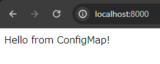

# Pod のカスタマイズ

これまでは Pod のコンテナを、イメージそのままでデプロイしてきましたが、環境変数や Volume Mount など、docker 同様に色々情報を与えてカスタマイズしたいことがあります。

## ConfigMap / Secret

ConfigMap と Secret は、key-value 形式で情報を保存できるオブジェクトです。

ConfigMap は非機微情報、Secret はその名の通り機微情報を扱うためのオブジェクトです。

ConfigMap や Secret は、

- コンテナの環境変数定義
- コンテナの Volume Mount の構成
- その他のオブジェクトの設定の記述

に使えます。

```yaml
apiVersion: v1
kind: ConfigMap
metadata:
  name: game-demo

data:
  # property-like keys; each key maps to a simple value
  player_initial_lives: "3"
  ui_properties_file_name: "user-interface.properties"

  # file-like keys
  game.properties: |
    enemy.types=aliens,monsters
    player.maximum-lives=5
  user-interface.properties: |
    color.good=purple
    color.bad=yellow
    allow.textmode=true
```

ConfigMap の例[^1]

[^1]: https://kubernetes.io/docs/concepts/configuration/configmap/

```yaml
apiVersion: v1
kind: Secret
metadata:
  name: dotfile-secret

stringData:
  .secret-file: "value"
```

Secret の例[^2]

[^2]: https://kubernetes.io/docs/concepts/configuration/secret/

### コンテナの環境変数

以下のように定義することで、Pod 内のコンテナに環境変数を与えることができます。

```yaml
apiVersion: v1
kind: Pod
metadata:
  name: caddy

spec:
  containers:
    - name: caddy
      image: caddy:2
      env:
        - name: TEST_ENV
          value: "my-value"
```

上記の例では `caddy` コンテナに、`TEST_ENV` という環境変数を `my-value` という値で供給しています。

> [!NOTE]
> Pod を直接定義することは実用上あまり無いですが、シンプルさのために Pod オブジェクトを直接書いて説明しています。
> Deployment や StatefulSet でも、Pod template 内で同様の記法が使えます。

### ConfigMap / Secret からの環境変数

ConfigMap や Secret で定義された値を、Pod 定義から環境変数として参照できます。

```yaml
apiVersion: v1
kind: Pod
metadata:
  name: caddy

spec:
  containers:
    - name: caddy
      image: caddy:2
      env:
        - name: TEST_ENV
          valueFrom:
            configMapKeyRef:
              name: game-demo # ConfigMap の名前
              key: player_initial_lives # ConfigMap 内の key 名
        - name: TEST_ENV_2
          valueFrom:
            secretKeyRef:
              name: dotfile-secret # Secret の名前
              key: .secret-file # Secret 内の key 名
      envFrom:
        # ConfigMap の全ての key-value ペアより環境変数を一括で設定
        - configMapRef:
            name: another-configmap
        # 同様に、Secret より環境変数を一括で設定
        - secretRef:
            name: another-secret
```

上の例では、`caddy` コンテナに与える環境変数として、

- `TEST_ENV` : `game-demo` という名前の ConfigMap から、`player_initial_lives` という key に対応する値
    - つまり値は `3`
- `TEST_ENV_2` : `dotfile-secret` という名前の Secret から、`.secret-file` という key に対応する値
    - つまり値は `value`

を設定しています。

また、Pod 定義で `envFrom` を使うことにより、ConfigMap や Secret 内の全ての key-value ペアをそのまま環境変数として、一括で供給できます。
例えば次のような ConfigMap があったとき、この key-value ペアをそのまま環境変数の名前と値として、一括で供給できます。

```yaml
apiVersion: v1
kind: ConfigMap
metadata:
  name: another-configmap

data:
  MY_ENV_FOO: "foo"
  MY_ENV_BAR: "bar"
  MY_ENV_BAZ: "baz"
```

### ConfigMap / Secret からの Volume Mount

ConfigMap や Secret の key-value ペア情報から、コンテナへの Volume Mount を構成できます。

```yaml
apiVersion: v1
kind: ConfigMap
metadata:
  name: my-html-files

data:
  index.html: |
    <html lang='en'>
      <body>
        <div>Hello from ConfigMap!</div>
      </body>
    </html>

---
apiVersion: v1
kind: Pod
metadata:
  name: caddy

spec:
  volumes:
    - name: my-cf-volume # ConfigMap から、この Pod の Volume を定義
      configMap:
        name: my-html-files
  containers:
    - name: caddy
      image: caddy:2
      volumeMounts:
        - mountPath: /usr/share/caddy
          name: my-cf-volume # .spec.volumes[].name で定義した名前
```

[../examples/6_configmap_pod.yaml](../examples/6_configmap_pod.yaml)

Pod 定義の `.spec.volumes` と `.spec.containers[].volumeMounts` から ConfigMap や Secret を参照することで、key-value ペアからファイルを生成し Volume Mount を構成できます。

上の場合、`/usr/share/caddy` ディレクトリがコンテナ内に Volume Mount され、ConfigMap の各 key-value に対応するファイルとその中身が生成されます。
コンテナのプロセスが `/usr/share/caddy/index.html` にアクセスすると、対応する value（ここでは HTML ファイル）が読み取れます。

実際に、ConfigMap から Volume Mount を構成した Pod を作ってみましょう。
次のコマンドを実行して、ConfigMap と Pod をクラスターに登録します。

- `kubectl apply -f ./examples/6_configmap_pod.yaml`

次のコマンドで、Pod の 80 番ポートへ port-forward を行います。

- `kubectl port-forward pod/caddy 8000:80`

手元のブラウザで http://localhost:8000/ を開き、ConfigMap の中身がWebページとして配信されていることを確認できれば成功です。



## ConfigMap / Secret のその他用法

ConfigMap や Secret は、Pod への環境変数と Volume Mount の構成**以外**にも使えます。

例えば Secret では `type` を設定することができ、特定の `type` では ServiceAccount などの他オブジェクトと連携する特殊な用法があります。

具体的な色々な用法については、[Secrets のドキュメント](https://kubernetes.io/docs/concepts/configuration/secret/)を覗くと良いでしょう。

## Secret の管理方法

Secret は機微情報を扱うオブジェクトのため、特定の人間やコンテナ以外には見せたくない情報が入っていることが多々あります。

したがって、他のオブジェクトとは異なる形で、定義の管理を行いたいことが多いです。

場面によって最適な方法も大きく異なるため、ここでは詳しくは解説しませんが、有名な方法として次のものがあります。

- [SOPS: Secret OPerationS](https://github.com/getsops/sops) : YAML 定義をそのまま暗号化してしまう方法
- [External Secrets Operator](https://github.com/external-secrets/external-secrets) : 外部に値を保存し、この「Operator」がクラスターに Secret オブジェクトを人間の代わりに書き込む方法

> [!NOTE]
> traP のクラスターでは、[ArgoCD](https://github.com/argoproj/argo-cd) + SOPS + [age](https://github.com/FiloSottile/age) で非対称暗号化を行い、GitOps で運用しています。
> [暗号化された Secret 例](https://github.com/traPtitech/manifest/blob/03ce70240d5e309777a57ac8820a8adf22d07f6f/ns-system/secrets/ns.yaml)を覗くと面白いかもしれません。

## 次へ

このページでは、ConfigMap と Secret の基本的な使い方を学びました。

次は、Pod の Volume Mount についてより詳しく解説します。

[./7_volumes.md](./7_volumes.md)
