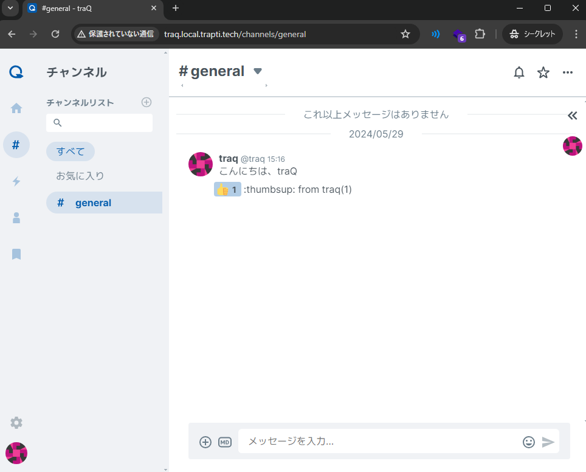

# 演習

これまでのページで、**基本的な Kubernetes の使い方**を、一通り学びました。

- Pod
- コントローラーと Deployment, StatefulSet
- Service, Ingress, IngressClass
- ConfigMap, Secret
- Volumes, PV, PVC, StorageClass

他にも本当にたくさんの要素がありますが、ここまで来れば、必要になった時に学んでいけるでしょう。

このページでは、これらの要素を使い、Webアプリケーションを一つ、フルスタックでデプロイします。

## traQ をデプロイする

[traQ](https://github.com/traPtitech/traQ) は、[デジタル創作同好会traP](https://trap.jp/) が完全独自開発した、Slack ライクなコミュニケーションツールです。


デプロイすべきコンポーネントは、以下の通りです。

- データベース (MySQL or MariaDB)
- [バックエンド](https://github.com/traPtitech/traQ)
- [フロントエンド](https://github.com/traPtitech/traQ_S-UI)

参考: [traPtitech/traQ: docs/deployment.md](https://github.com/traPtitech/traQ/blob/master/docs/deployment.md)

他にも Optional なコンポーネントが存在しますが、まずは最低限のデプロイを目指します。

これ以降のこのページでは、デプロイの手順を正解例と共に詳細に解説します。
必要な情報は上の `docs/deployment.md` ドキュメントにまとまっていますので、自身でチャレンジしたい方はぜひやってみてください。
ただし無理をする必要は無いので、適宜以下のヒントや正解も覗いてみてください。

### データベースをデプロイする

バックエンドが依存するデータベースをデプロイします。

MySQL でも良いですが、ここでは MariaDB を用いることとします。

MariaDB はファイルの永続化が必要な、ステートフルなアプリケーションです。
ステートフルということは、StatefulSet で管理を行うべきです。
また、PVC を適切に使い、必要なデータを永続化すべきです。

`mariadb` イメージの詳しい使い方は、[mariadb | Docker Hub](https://hub.docker.com/_/mariadb) のドキュメントを参照してください。
Docker Hub のドキュメントには、コンテナ内のどのパスを永続化したら良いのか、また初期パスワードの設定方法などが書かれています。

デプロイすべきリソースが分かりましたか？

一例を [../examples/8_traq/mariadb.yaml](../examples/8_traq/mariadb.yaml) に示します。

以下が必要なリソースの一例です。

- StatefulSet と対応する Service
- PVC
- 機微情報を環境変数に渡すための Secret
    - 再度ですが、一般に、Secret は別手段で管理することが多いです。
    - 今回はシンプルさのため、そのまま他のリソースとともに yaml の定義を置いています。

> [!NOTE]
> 上の例がたった一つの正解ではありません。
> もちろん `mysql` などの別のイメージを利用したり、または StatefulSet の `volumeClaimTemplates` を利用して PVC を確保しても良いです。
> [../examples/8_traq](../examples/8_traq) にある yaml は、このハンズオンで学んだ範囲の記法で書ける一例を示しています。

### バックエンドをデプロイする

traQ アプリケーションのバックエンドをデプロイしましょう。

明確な記載はありませんが、traQ バックエンドは monolithic なアプリケーションであり、内部で不可分な状態を持っているため、StatefulSet でデプロイすることが望ましいです。

一般に、その他のアプリケーションをデプロイする時も、そのアプリケーションが**ステートレス**であるかは注意して確認しましょう。
全てのアプリが分散環境で動くことを想定して作られているわけではありません。
複雑なアプリでは、内部で不可分な状態があるため、複数コンテナ（プロセス）が同時に存在すると、期待した動作にならない可能性があります。

traQ のバックエンド及びフロントエンドは、ビルド済みの Docker Image が GitHub Container Registry に存在しているため、これをそのまま使うことができます。

次に、設定ファイルや必要な環境変数を確認しましょう。
細かく転記はしませんが、[traQ リポジトリのドキュメント](https://github.com/traPtitech/traQ/blob/master/docs/deployment.md)に記載があります。

また、永続化が必要なディレクトリーも存在するため、確認しましょう。

正解の一例を [../examples/8_traq/traq.yaml](../examples/8_traq/traq.yaml) に示します。

以下が必要なリソースの一例です。

- StatefulSet と対応する Service
- 永続化のための PVC
- 設定ファイルを記述する ConfigMap

ConfigMap の Volume Mount で一つ見慣れない記法があります。

```yaml
          volumeMounts:
            - mountPath: /app/config.yml
              name: config
              subPath: config.yml
              readOnly: true
```

上のように `subPath` を指定することで、ConfigMap の中の特定の key のみを Volume Mount することができます。
また、`readOnly` は文字通り、読み取り専用のファイル権限での Volume Mount を指示します。

もう一つの注意点として、StatefulSet の `.spec.template.spec.enableServiceLinks` が `false` と明示的に設定されています（デフォルト: `true`）。
挙動の詳細は公式ドキュメント[^2]を見ると分かりますが、これがデフォルトの `true` では、Pod に関連する Service の情報を環境変数で供給してきます（勝手に供給*してきやがります*）。
traQ バックエンドを含む、特定のアプリケーションで読み取る環境変数と、これらの環境変数名が衝突する場合は、`enableServiceLinks: false` として環境変数の供給を断つ必要があります。

[^2]: https://kubernetes.io/docs/tutorials/services/connect-applications-service/#accessing-the-service

> [!NOTE]
> Tips: リソースの yaml 定義は長くなることがあります。
> 意味的に区切れる / 自身で分かりやすいと思った箇所で、適宜空行を入れると読みやすくなります。

### フロントエンドをデプロイする

traQ のフロントエンドをデプロイしましょう。

フロントエンドは静的ファイルを配信するだけで、**ステートレス**なWebサーバーです。
したがって、Deployment を使うのが適しているでしょう。

正解の一例を [../examples/8_traq/traq-ui.yaml](../examples/8_traq/traq-ui.yaml) に示します。

以下が必要なリソースの一例です。

- Deployment
- Service
- ConfigMap

Deployment の replica 数は 2 としていますが、それ以上でもOKです。
ただし、静的配信のWebサーバーは負荷が掛かるアプリケーションではないため、あまり多くの replica は必要無いでしょう。

### ルーティングを設定する

これでコンテナ達はデプロイできましたが、まだクラスター外からアクセスができません。

Ingress を設定して、アクセスできるようにしましょう。

正解の一例を [../examples/8_traq/ingress.yaml](../examples/8_traq/ingress.yaml) に示します。

traQ ドキュメントの Caddyfile と同等なルーティングを設定しています。

一つ、見慣れない yaml の記法があります。

```yaml
          - path: /api
            pathType: Prefix
            backend: &traq-backend
              service:
                name: traq
                port:
                  number: 80

          - path: /.well-known
            pathType: Prefix
            backend:
              <<: *traq-backend
```

これは anchor と呼ばれるものです。
上の yaml は、以下のものと同等です。

```yaml
          - path: /api
            pathType: Prefix
            backend:
              service:
                name: traq
                port:
                  number: 80

          - path: /.well-known
            pathType: Prefix
            backend:
              service:
                name: traq
                port:
                  number: 80
```

Anchor を過剰に使うと読みづらくなってしまいますが、適切に使うことで記述の重複を減らし、変更漏れを防止できます。

### リソース定義を kustomize でまとめる

ここまで、4 つの yaml ファイルと、それぞれのファイルの中には多くのリソースが登場しました。
今回は 4 つのファイルをそれぞれ `kubectl apply` すれば大丈夫ですが、もっと増えると大変です。

ここで登場するのが、kustomize[^1] です。
Kustomize は複数の Kubernetes リソース定義をまとめて、「ビルド」を行います。
また、この過程で簡単なフィールドの置換も行えますが、今回はやりません。

Kustomize は kubectl コマンドに同梱されているため、インストールの必要はありません。

[^1]: https://github.com/kubernetes-sigs/kustomize

基本的な使い方は簡単で、リソース定義の yaml が入ったディレクトリーに、`kustomization.yaml` を以下のような内容で配置します。

```yaml
resources:
  - mariadb.yaml
  - traq.yaml
  - traq-ui.yaml
  - ingress.yaml
```

これだけで、kustomize を使う準備は完了です。

次のコマンドで「ビルド」を行うと、`kustomization.yaml` で列挙したリソース定義が、全て繋がって標準出力に出てきます！

- `kubectl kustomize ./examples/8_traq`

```plaintext
$ kubectl kustomize ./examples/8_traq
apiVersion: v1
data:
  config.yml: |
...
```

この出力を確認して、そのまま `kubectl apply` に渡してやると、一発で全てのリソースをクラスターに適用できます。

- `kubectl kustomize ./examples/8_traq | kubectl apply -f -`
- もしくは、`kubectl apply -k ./examples/8_traq` でも同等

```plaintext
$ kubectl kustomize ./examples/8_traq | kubectl apply -f -
configmap/traq created
configmap/traq-ui created
secret/mariadb-password created
service/mariadb created
service/traq created
service/traq-ui created
persistentvolumeclaim/mariadb created
persistentvolumeclaim/traq created
deployment.apps/traq-ui created
statefulset.apps/mariadb created
statefulset.apps/traq created
ingress.networking.k8s.io/traq created
```

各リソースの状況を見て、正常に動作しているかを確認しましょう。

- `kubectl get pods`
- `kubectl get ingress`
- ... その他のリソースも適宜確認しましょう。

### アプリケーションの動作を確認する

http://traq.local.trapti.tech/ へ手元のブラウザからアクセスしましょう。

全て上手くいっていれば、`id: traq, pass: traq` でログインして、アプリケーションが使えるはずです。

もし上手くいかなければ、`kubectl get リソース名` でリソースの状況をチェックして、起動に失敗しているコンテナや、動いていないリソースが無いかを確認しましょう。



### お掃除

次のコマンドで、**全てのリソース**を削除できます。
PVC も含まれているため、**永続化したボリューム**の内容も削除されることに気をつけてください。

- `kubectl delete -k ./examples/8_traq`

PVC だけは残して Pod だけを落としたい場合、必要なリソースだけを選択して削除することで可能です。

- `kubectl delete statefulset traq`
- `kubectl delete deployment traq-ui`

もしくは kubectl を用いて Deployment や StatefulSet の「スケール」が可能です。

「スケール」とは、単に `.spec.replicas` の値を変更することです。
0 にすることで Pod を完全に消去できます。

- `kubectl scale --replicas=0 statefulset/traq`
- `kubectl scale --replicas=0 deployment/traq-ui`

## ハンズオンクラスターのお掃除

ここでハンズオンはおしまいです。

ハンズオンに使った Kubernetes クラスター全体をシャットダウンするには、次のコマンドを使います。
**データは一切保存されない**ため、必要なデータが残っていないかをよく確認してください。
（おそらく無いと思いますが...）

- `k3d cluster delete hands-on`

逆に言えば、これで手元の環境はほとんど汚れずにハンズオンを完了できました。

Kubernetes は「宣言的」にリソースを管理するため、環境の再現やシャットダウンがたいへん楽です。
これを俗に Build & Scrap と言ったりします。
どんどん仮想環境を作って壊して学びましょう。

## 次へ

Kubernetes を用いて、一つのWebアプリケーションをフルスタックでデプロイできました！
大変お疲れ様でした。

これで基本的な Kubernetes の使い方を、本当に一通り学べたはずです。

次のページでは、まとめと、これからの学び方について軽くさらいます。

[./9_summary.md](./9_summary.md)
